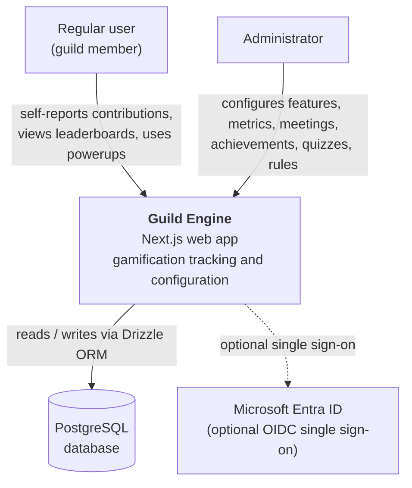
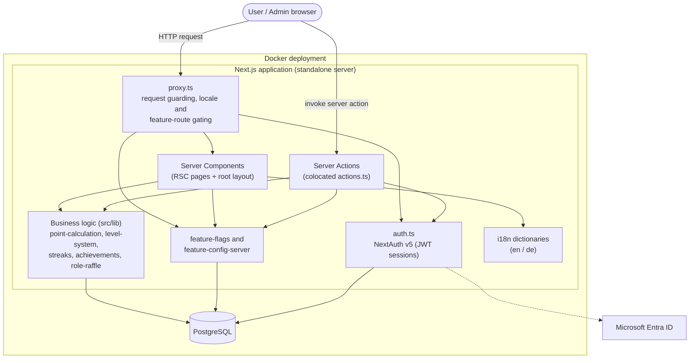
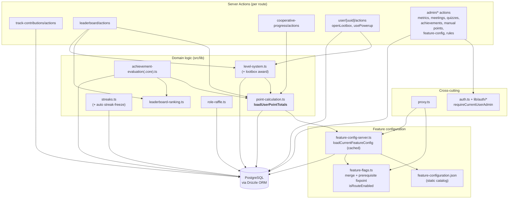
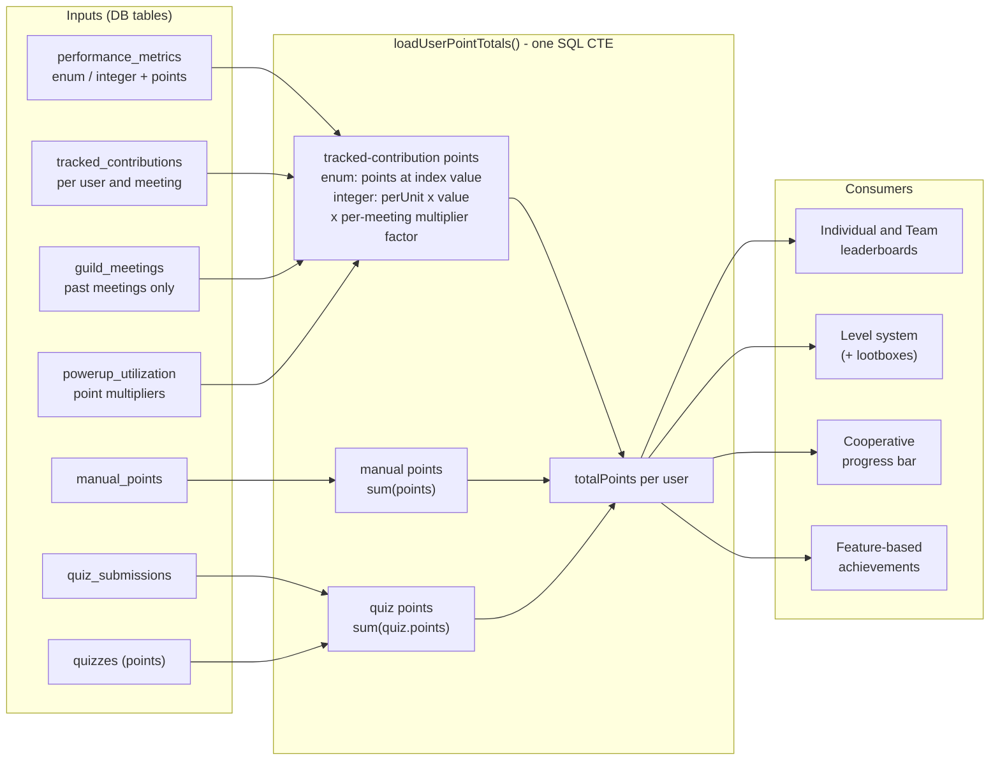
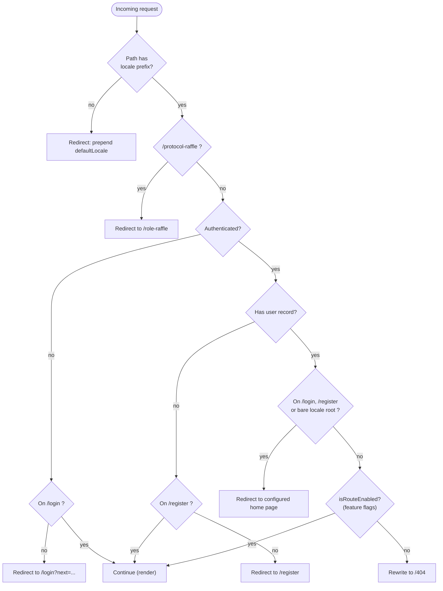
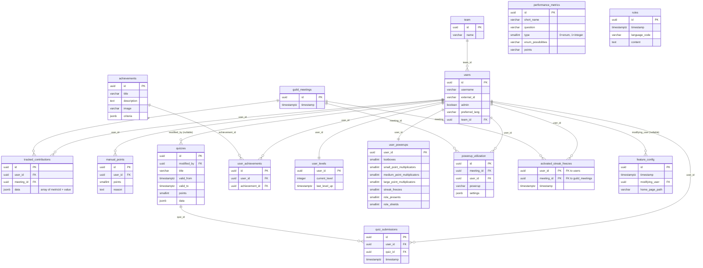

# Guild Engine — Architecture Diagrams

This document collects the architecture diagrams in [Mermaid](https://mermaid.js.org/) format. They are
organised roughly along the **C4 model** abstraction levels (System Context → Container → Component),
followed by three focused diagrams: the central **point-calculation data flow**, the **request /
auth / redirect flow** implemented in `proxy.ts`, and the **domain data model** (entity–relationship).

See [`architecture.md`](./architecture.md) for the prose descriptions these diagrams summarise.

---

## L1 — System Context

The system, its human actors and its external dependencies.

## L2 — Containers

The main runtime building blocks inside the deployment. The Next.js app is a single server-side
container; the browser renders server components and invokes server actions.

## L3 — Components (server side)

The server-side modules and how they collaborate. `point-calculation.loadUserPointTotals` (bold) is the
central scoring function reused across the app.

## Point-calculation data flow

How `loadUserPointTotals` (in `src/lib/point-calculation.ts`) combines its inputs into a single total,
and which features consume that total.

## Request / auth / redirect flow (`proxy.ts`)

The decision tree applied to every matched request before a page renders.

## Domain data model (entity–relationship)

The PostgreSQL schema (`src/db/schema.ts`). Foreign keys are shown as relationships. Note that
`performance_metrics` is linked to `tracked_contributions` only *logically* (metric ids are stored
inside the `tracked_contributions.data` JSONB array), not via a database foreign key.

> `feature_config` also holds one boolean `*_enabled` column and one JSONB `*_config` column per
> feature (point-system, individual/team leaderboard, level-system, badges, cooperative-progress-bar,
> streaks, minigames, powerups); these are omitted from the diagram for brevity. Each save inserts a new
> row (append-only versioning).
